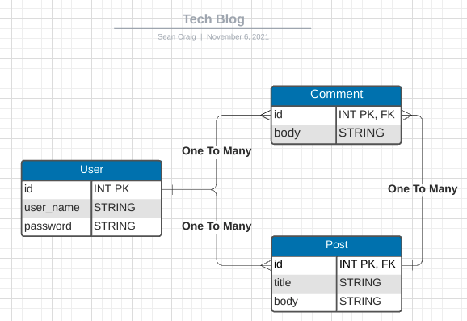
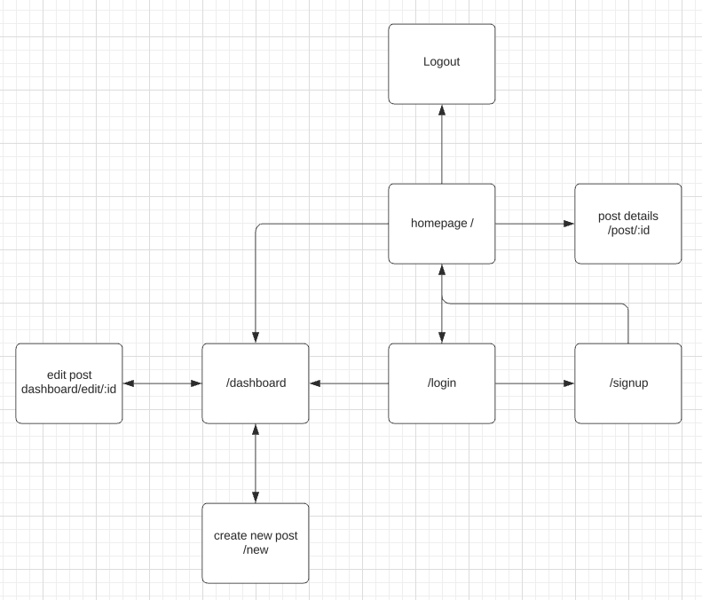
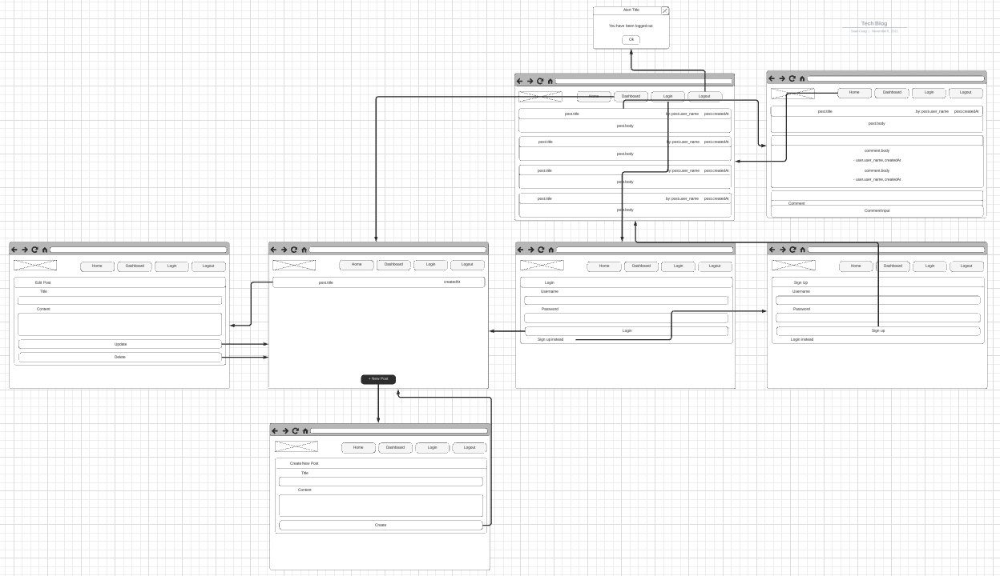

# Tech Blog

  

  ## Description
  A CMS-style blog site similar to a Wordpress site, where users can publish their blog posts and comment on other users' posts as well.

  Here is an ERD I created to structure the database.
  

  Here is a flow chart I created to structure the flow of the web site.
  

  Here is a wire frame I created to structure each page.
  

  ## Table of Contents
  - [Installation](#installation)
  - [Usage](#usage)
  - [Credits](#credits)
  - [License](#license)
  - [Contributing](#contributing)
  - [Tests](#tests)
  - [Questions](#questions)

  ## Installation 
  Use git clone to clone the repository on your local machine and then run npm i

  ## Usage 
  run npm start then open a web browser to http://localhost:3001/

  ## Credits 
  Sean Craig

  ## License 
  [License MIT](https://opensource.org/licenses/MIT)

  ## Contributing
  Pull requests are welcome. For major changes, please open an issue first to discuss what you would like to change.

  ## Tests
  There are currently no tests

  ## Questions
  If you have any questions about this project please send me an email at seancraig21@gmail.com or reach out to me on Github my username is seanscraig
